# LIRI: A Node.js CLI Application
Similar to SIRI, the speech interpretation and recognition interface, LIRI is a language interpretation and recognition interface. This CLI (command line interface) uses the Node.js terminal to accept specific commands from the user, then queries one of 3 APIs to give the user search results about upcoming concerts, information about songs, or information about a movie. Data returned from the APIs is logged to the console as well as added to a log.txt file. Additional Node.js packages required for this app are axios, node fs, and moment.js.

## Getting User Commands
Liri accepts 4 different terminal input commands and search criteria using process.argv:
* **concert-this** triggers a function that uses Axios to query the Bandsintown API for upcoming concerts for the artist requested & prints the results to the console and a log file.
* **spotify-this-song** triggers a function requests the Spotify API for info about the song requested & prints the results to the console and a log file.
* **movie-this** triggers a function that uses Axios to search the OMDB API for info on the movie requested & prints the results to the console and a log file.
* **do-what-it-says** triggers a function that uses the Node fs package to pull data from a random text file & run the command & search specified in the file.

An if else statement determines which of the 4 recognized commands was selected & runs the appropriate function. All other commands will display a "command not recognized" message in the console.

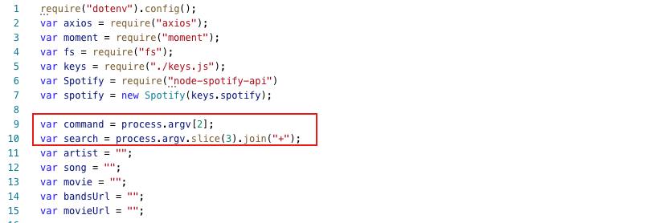

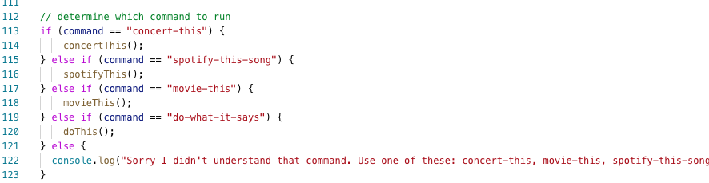

## Search Parameters
The search criteria for each API is determined by the process.argv input starting at index 3. See screenshot above. Next the app runs a function to get the appropriate query URL based on which command was chosen & adds the search criteria to the API query url.

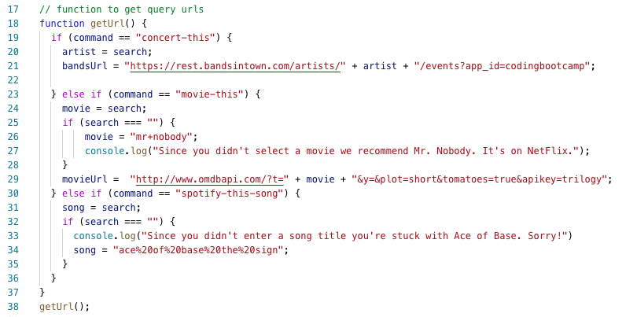

## Search Results 
Liri uses Axios to get data from the API specified in the command.

* **Bands in Town: concert-this**
    * Axios is used to get data for the Bandsintown API. An additional if else statement is used to get the appropriate location format depending on whether or not a state/region needs to be included in the result. Moment.js is used to display the concert dates in a readable format.

    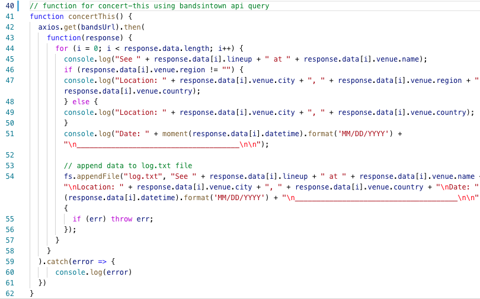

    * Results from the Bandsintown API are printed to the console & appended to a log.txt file using node fs.

    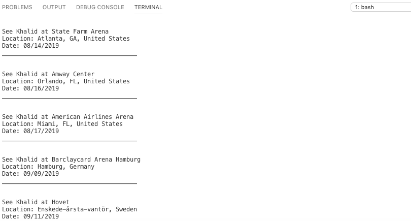
* **Spotify: spotify-this-song**
    * This function works the same as the concertThis function above except it uses a request instead of Axios to get info from the Spotify API.

    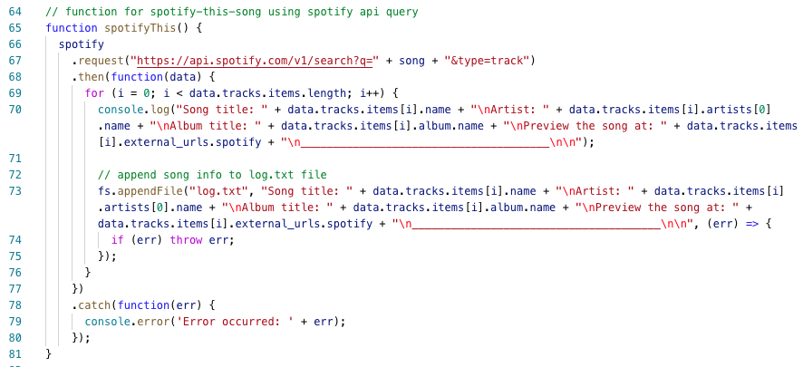

    * Results from the Spotify API are printed to the console & appended to a log.txt file using node fs.

    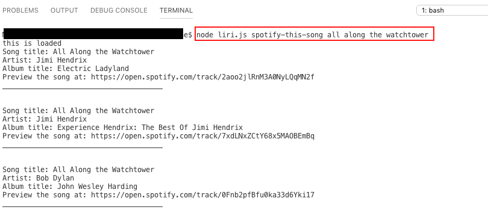

    * If no search parameters are entered for the Spotify API LIRI returns Ace of Base results.

    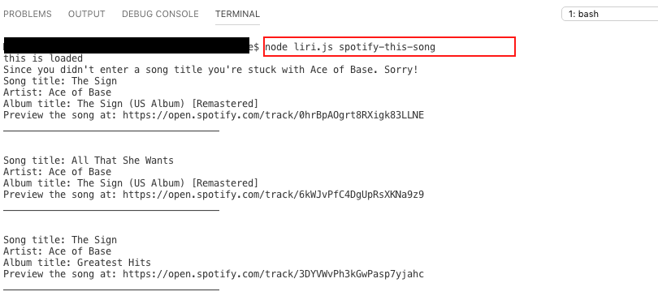

* **OMDB: movie-this**
    * Axios is used to get data from the OMDB API.

    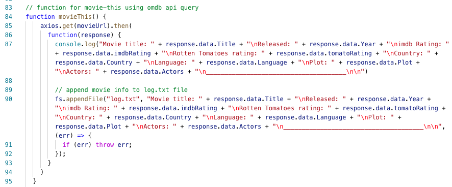

    * Results are printed to the console & appended to the log.txt file.

    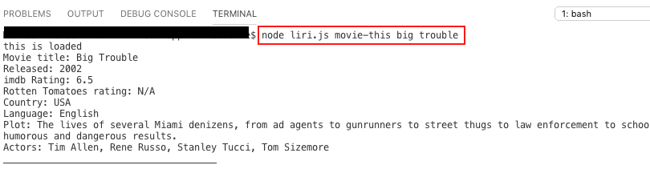

    * If no search parameters are input LIRI returns results for Mr. Nobody.

    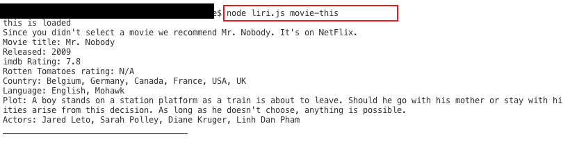
* **do-what-it-says**
    * This function uses Node fs readFile to read the text in the random.txt file. Then it is split to an array used to call the spotify function.

    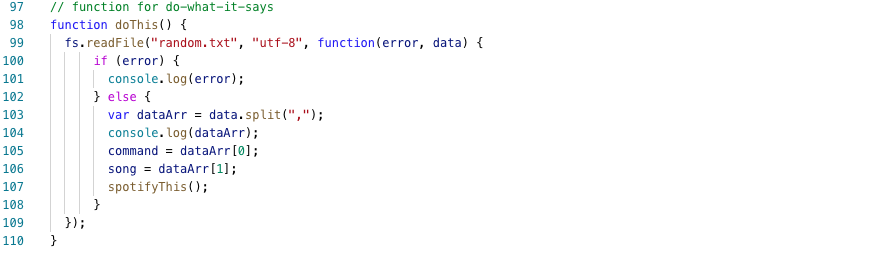

    * Results

    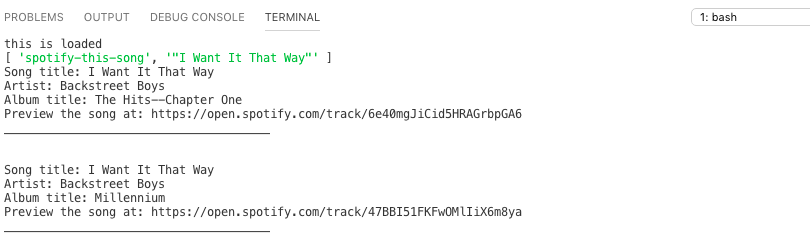

